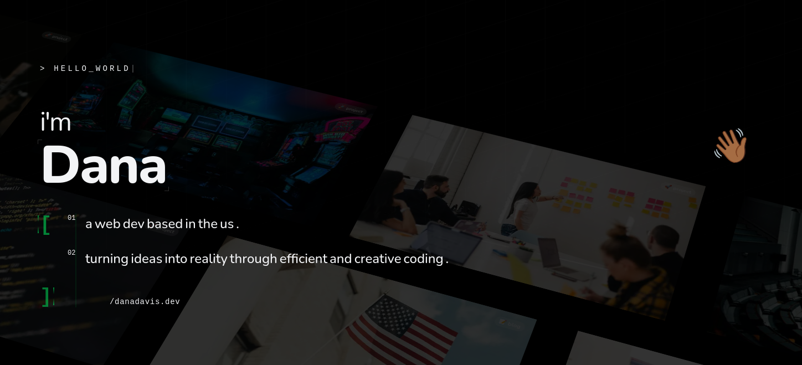
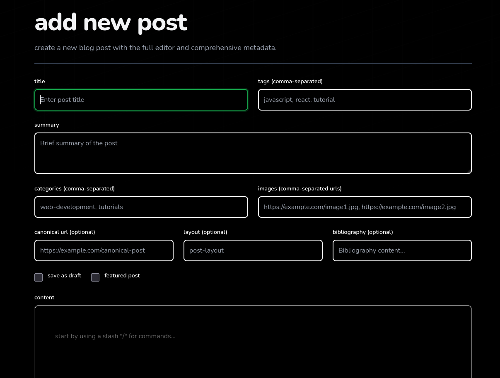

# 🚀 Dana Davis's Dev Blog

<div align="center">



[](https://danadavis.dev)
[](https://nextjs.org/)
[](https://tailwindcss.com/)
[](https://www.typescriptlang.org/)

</div>

<p align="center">
  <em>"My personal space on the cloud where I document my programming journey, sharing lessons, insights, and resources for fellow developers."</em>
</p>

<p align="center">
  <a href="#features">Features</a> •
  <a href="#tech-stack">Tech Stack</a> •
  <a href="#additions-and-changes">Additions & Changes</a> •
  <a href="#contributing">Contributing</a>
</p>

---

## 🌟 About

Welcome to **danadavis.dev**, my personal blog and portfolio built with modern web technologies. This is where I share my experiences, tutorials, project showcases, and insights from my journey as a software engineer.

> **Sharing is learning!**  
> I started this blog to document and share things I've learned and found useful. Writing helps solidify my understanding and hopefully provides value to the developer community.

## ✨ Features

- **📝 Blog Posts**: Rich MDX-powered articles with code syntax highlighting
- **📚 Books & Movies**: Personal recommendations and reviews
- **💼 Projects Portfolio**: Showcase of my development projects
- **🔧 Code Snippets**: Reusable code snippets and utilities
- **🏷️ Tags System**: Organized content by topics
- **🔍 Search Functionality**: Powered by KBar for quick navigation
- **🌙 Dark Mode**: GitHub dark dimmed theme support
- **📊 Analytics**: Umami integration for privacy-focused tracking
- **�️ Database**: Supabase with Drizzle ORM for type-safe operations
- **🔐 Admin Panel**: Manage posts, comments, and more
- **🎵 Integrations**: Spotify now-playing, GitHub activities, and more
- **📱 Responsive Design**: Optimized for all devices

## �️ Tech Stack

| Category       | Technologies                                  |
| -------------- | --------------------------------------------- |
| **Frontend**   | Next.js 15 (App Router), React 19, TypeScript |
| **Styling**    | Tailwind CSS, PostCSS                         |
| **Content**    | Contentlayer, MDX                             |
| **Database**   | Supabase, Drizzle ORM, Prisma                 |
| **Analytics**  | Umami                                         |
| **Linting**    | Biome                                         |
| **Deployment** | Vercel                                        |

## 🔄 Additions and Changes from Original Repository

This blog is forked and heavily customized from [leohuynh.dev](https://github.com/hta218/leohuynh.dev), a Next.js starter blog. Here are the key additions and modifications:

### 🎨 Visual & UI Enhancements

- **Hero Parallax Landing**: Custom animated hero section with infinite scrolling projects/blog posts, kinetic typography, and interactive parallax effects built with Framer Motion
- **Custom Color Scheme**: Implemented Black, Orange, and Green theme (replacing default blues)
- **Interactive Header Section**: Dynamic mouse-tracking effects, animated title reveals, and glitch-style typography
- **Responsive Animations**: Separate mobile and desktop animation strategies for optimal performance
- **Enhanced Components**: Custom UI components with advanced motion effects and styling

### � Content Management

- **Books & Movies Sections**: Personal book and movie tracking with ratings and filtering system
- **Code Snippets**: Dedicated section for sharing reusable code snippets with tagging
- **Comprehensive Tags System**: Organized content discovery across all sections
- **Rich Media Support**: Better handling of images, videos, and media in posts

### 🔧 Content Management System & Authentication



- **Themed CMS Admin Panel**: Full-featured dashboard for managing blog posts, media, and comments
  - Add/Edit/Delete posts with Novel.sh rich text editor
  - Post management with filtering and organization
  - Built-in authentication with Kinde Auth for secure access
  - Comprehensive metadata management (tags, categories, images, canonical URLs)
  - Draft and featured post toggles for content workflow
- **Novel.sh Editor**: Advanced AI-powered WYSIWYG editor with support for formatting, links, images, code blocks, and slash commands
- **Type-Safe Database**: Supabase + Drizzle ORM for dynamic content management and querying
- **Admin Dashboard**: Secure access to manage all content through an authenticated interface

### 🔗 API Integrations & Data

- **GitHub Integration**: GitHub GraphQL API for displaying user activities and contributions
- **Spotify Integration**: Now-playing track display with album artwork and playback info
- **RSS Feed Generation**: Automated RSS feed creation from blog posts
- **Newsletter Support**: Email subscription API endpoint
- **Post Metadata**: Dynamic post views tracking and engagement metrics

### 📊 Analytics & Features

- **Umami Analytics**: Privacy-focused website analytics integration
- **Admin Dashboard**: View site statistics, post performance, and user engagement
- **Search Functionality**: KBar command palette for content search and navigation
- **Social Sharing**: Built-in share buttons for social media distribution
- **Comments System**: Disqus integration for reader engagement

### 🎯 Technical Improvements

- **Performance Optimization**: Advanced animation optimization, lazy loading, and bundle analysis
- **Error Handling**: Improved error boundaries and logging across the application
- **TypeScript Coverage**: Full type safety with Prisma schema definitions
- **SEO**: Enhanced meta tags, JSON-LD structured data, and dynamic sitemaps

## 🚀 Getting Started with Deployment

Before deploying to production, you'll need to gather API credentials from various services. Here's a straightforward guide to get all the keys you need:

### Prerequisites

- A [Vercel](https://vercel.com) account (for hosting)
- A [GitHub](https://github.com) account (for repository connection)
- Browser access to set up services

### 1. **Database Setup** 📦

#### Supabase (PostgreSQL Database)

1. Go to [supabase.com](https://supabase.com) and sign in
2. Click **"New Project"** and select your organization
3. Enter a project name and set a strong database password
4. Choose a region close to your users
5. Wait for the project to be created (~2 minutes)
6. Navigate to **Settings > Database**
7. Copy the **Connection String** (choose "URI" format) and set it as `DATABASE_URL`

**Environment Variable:** `DATABASE_URL`

---

### 2. **Authentication Setup** 🔐

#### Kinde Auth (Admin Dashboard Protection)

1. Visit [kinde.com](https://kinde.com) and create a free account
2. Go to **Settings > Applications** in your dashboard
3. Click **"Create Application"** and name it (e.g., "Dana's Blog")
4. Copy these credentials:
   - **Client ID** → `KINDE_CLIENT_ID`
   - **Client Secret** → `KINDE_CLIENT_SECRET` (click "View Secret")
5. Go to **Settings > Applications > Details**
6. Under "Allowed callback URLs," add: `https://yourdomain.com/api/auth/kinde/callback`
7. Under "Allowed logout redirect URLs," add: `https://yourdomain.com`

**Environment Variables:**

- `KINDE_CLIENT_ID`
- `KINDE_CLIENT_SECRET`
- `KINDE_ISSUER_URL` (format: `https://yourdomain.kinde.com`)
- `KINDE_SITE_URL` (your production URL)
- `KINDE_POST_LOGOUT_REDIRECT_URL`
- `KINDE_POST_LOGIN_REDIRECT_URL`
- `NEXT_PUBLIC_KINDE_CLIENT_ID`
- `NEXT_PUBLIC_KINDE_DOMAIN`

---

### 3. **GitHub Integration** 🐙

#### GitHub API Token

1. Go to [github.com/settings/tokens](https://github.com/settings/tokens)
2. Click **"Generate new token"** → **"Generate new token (classic)"**
3. Name it "Blog API" and set expiration (90 days recommended)
4. Check these scopes:
   - `repo` (full control of private repositories)
   - `read:user` (read user profile data)
5. Click **"Generate token"** and copy it immediately (it won't show again)

**Environment Variable:** `GITHUB_API_TOKEN`

---

### 4. **Music Integration** 🎵

#### Spotify API Credentials

1. Go to [developer.spotify.com/dashboard](https://developer.spotify.com/dashboard)
2. Log in with or create a Spotify account
3. Click **"Create App"** and accept the Developer Terms
4. Fill in the form:
   - **App Name:** "Dana's Blog"
   - **App Description:** "Displays currently playing track"
5. Copy the credentials:
   - **Client ID** → `SPOTIFY_CLIENT_ID`
   - **Client Secret** → `SPOTIFY_CLIENT_SECRET` (click "Show Client Secret")
6. Click **"Edit Settings"** and add Redirect URI:
   - `https://yourdomain.com/api/spotify/callback`

**To Get Refresh Token:**

After deploying, visit your deployed app's authorization URL:

```
https://accounts.spotify.com/authorize?client_id=YOUR_CLIENT_ID&response_type=code&redirect_uri=https://yourdomain.com/api/spotify/callback&scope=user-read-currently-playing
```

This will redirect to your callback page with an authorization code. Use this to generate a refresh token (detailed instructions in the callback page).

**Environment Variables:**

- `SPOTIFY_CLIENT_ID`
- `SPOTIFY_CLIENT_SECRET`
- `SPOTIFY_REFRESH_TOKEN` (obtain via authorization flow)

---

### 5. **Analytics Setup** 📊

#### Umami Analytics

1. Go to [umami.is](https://umami.is) and create an account
2. Create a new website and enter your domain
3. Copy the **Tracking ID**

**Environment Variable:** `NEXT_UMAMI_ID`

---

### 6. **Stripe (Optional - For Store Feature)** 💳

1. Go to [stripe.com](https://stripe.com) and create an account
2. Go to **Developers > API Keys**
3. Copy your **Secret Key** (Test Mode) → `STRIPE_SECRET_KEY`
4. Copy your **Publishable Key** (Test Mode) → `NEXT_PUBLIC_STRIPE_PUBLISHABLE_KEY`

**Environment Variables:**

- `STRIPE_SECRET_KEY`
- `NEXT_PUBLIC_STRIPE_PUBLISHABLE_KEY`

---

### 7. **Deployment on Vercel** ☁️

1. Go to [vercel.com](https://vercel.com) and sign in with GitHub
2. Click **"Add New" > "Project"**
3. Select your blog repository from GitHub
4. Click **"Import"**
5. Go to **Settings > Environment Variables**
6. Add all the environment variables from above
7. Click **"Deploy"**

Or

### One Click Deploy

[](https://vercel.com/new/clone?repository-url=https://github.com/xi-Rick/danadavis.dev&env=DATABASE_URL,ADMIN_EMAIL,KINDE_CLIENT_ID,KINDE_CLIENT_SECRET,KINDE_ISSUER_URL,KINDE_SITE_URL,KINDE_POST_LOGOUT_REDIRECT_URL,KINDE_POST_LOGIN_REDIRECT_URL,NEXT_PUBLIC_KINDE_CLIENT_ID,NEXT_PUBLIC_KINDE_DOMAIN,NEXT_PUBLIC_KINDE_EMAIL_CONNECTION_ID,NEXT_PUBLIC_KINDE_GOOGLE_CONNECTION_ID,NEXT_PUBLIC_KINDE_GITHUB_CONNECTION_ID,STRIPE_SECRET_KEY,NEXT_PUBLIC_STRIPE_PUBLISHABLE_KEY,NEXT_PUBLIC_DISQUS_SHORTNAME,GITHUB_API_TOKEN,SPOTIFY_CLIENT_ID,SPOTIFY_CLIENT_SECRET,SPOTIFY_REFRESH_TOKEN,NEXT_UMAMI_ID&envDescription=Environment%20variables%20required%20to%20run%20the%20Dana%20Davis%20Dev%20Blog)

That's it! Your blog is now live. 🎉

---

### 📋 Complete Environment Variables Checklist

```bash
# Database
DATABASE_URL=

# Authentication
KINDE_CLIENT_ID=
KINDE_CLIENT_SECRET=
KINDE_ISSUER_URL=
KINDE_SITE_URL=
KINDE_POST_LOGOUT_REDIRECT_URL=
KINDE_POST_LOGIN_REDIRECT_URL=
NEXT_PUBLIC_KINDE_CLIENT_ID=
NEXT_PUBLIC_KINDE_DOMAIN=

# GitHub
GITHUB_API_TOKEN=

# Spotify
SPOTIFY_CLIENT_ID=
SPOTIFY_CLIENT_SECRET=
SPOTIFY_REFRESH_TOKEN=

# Analytics
NEXT_UMAMI_ID=

# Stripe (Optional)
STRIPE_SECRET_KEY=
NEXT_PUBLIC_STRIPE_PUBLISHABLE_KEY=
```

---

## �📈 Star History

<a href="https://star-history.com/#xi-Rick/danadavis.dev&Date">
  <picture>
    <source media="(prefers-color-scheme: dark)" srcset="https://api.star-history.com/svg?repos=xi-Rick/danadavis.dev&type=Date&theme=dark" />
    <source media="(prefers-color-scheme: light)" srcset="https://api.star-history.com/svg?repos=xi-Rick/danadavis.dev&type=Date" />
    
  </picture>
</a>

## 🤝 Contributing

Contributions, issues, and feature requests are super welcome! 🍻

Feel free to:

- [Open an issue](https://github.com/xi-Rick/danadavis.dev/issues) for bugs or suggestions
- [Submit a pull request](https://github.com/xi-Rick/danadavis.dev/pulls) with improvements
- Share your thoughts in the discussions

## 📄 License

Copyright © 2019-present | Dana's dev blog – stories, insights, and ideas.

---

<div align="center">

Made with ❤️ by [Dana Davis](https://danadavis.dev)

</div>
