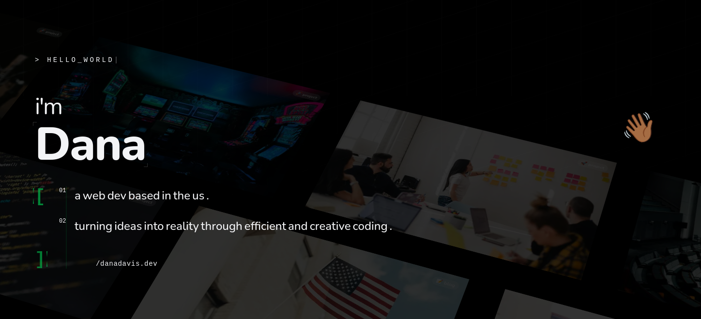
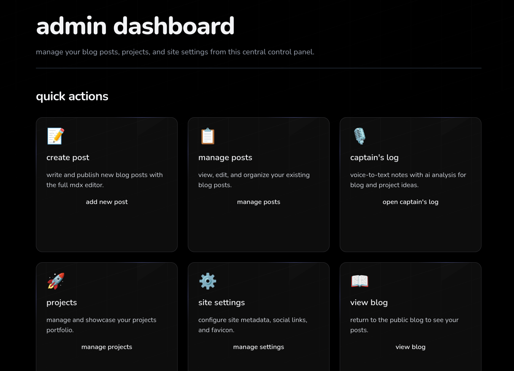

# 🚀 Dana Davis's Dev Blog

<div align="center">



[](https://danadavis.dev)
[](https://nextjs.org/)
[](https://tailwindcss.com/)
[](https://www.typescriptlang.org/)

</div>

<p align="center">
  <em>"My personal space on the cloud where I document my programming journey, sharing lessons, insights, and resources for fellow developers."</em>
</p>

<p align="center">
  <a href="#-features">Features</a> •
  <a href="#%EF%B8%8F-tech-stack">Tech Stack</a> •
  <a href="#-additions-and-changes-from-original-repository">Additions & Changes</a> •
  <a href="#-contributing">Contributing</a>
</p>

---

## 🌟 About

Welcome to **danadavis.dev**, my personal blog and portfolio built with modern web technologies. This is where I share my experiences, tutorials, project showcases, and insights from my journey as a software engineer.

> **Sharing is learning!**  
> I started this blog to document and share things I've learned and found useful. Writing helps solidify my understanding and hopefully provides value to the developer community.

## ✨ Features

- **📝 Blog Posts**: Rich MDX-powered articles with code syntax highlighting
- **📚 Books & Movies**: Personal recommendations and reviews
- **💼 Projects Portfolio**: Showcase of my development projects
- **🔧 Code Snippets**: Reusable code snippets and utilities
- **🏷️ Tags System**: Organized content by topics
- **🔍 Search Functionality**: Powered by KBar for quick navigation
- **🌙 Dark Mode**: GitHub dark dimmed theme support
- **📊 Analytics**: Umami integration for privacy-focused tracking
- **🗄️ Database**: PostgreSQL with Prisma ORM for type-safe operations
- **🔐 Admin Panel**: Manage posts, comments, and more
- **🎵 Integrations**: Spotify now-playing, GitHub activities, and more
- **📱 Responsive Design**: Optimized for all devices

## �️ Tech Stack

| Category       | Technologies                                  |
| -------------- | --------------------------------------------- |
| **Frontend**   | Next.js 15 (App Router), React 19, TypeScript |
| **Styling**    | Tailwind CSS, PostCSS                         |
| **Content**    | Contentlayer, MDX                             |
| **Database**   | PostgreSQL (Supabase), Prisma ORM             |
| **Analytics**  | Umami                                         |
| **Linting**    | Biome                                         |
| **Deployment** | Vercel                                        |

## 🔄 Additions and Changes from Original Repository

This blog is forked and heavily customized from <a href="https://github.com/hta218/leohuynh.dev" target="_blank" rel="noopener" referrerpolicy="origin">leohuynh.dev</a>, a Next.js starter blog. Here are the key additions and modifications:

### 🎨 Visual & UI Enhancements

- **Hero Parallax Landing**: Custom animated hero section with infinite scrolling projects/blog posts, kinetic typography, and interactive parallax effects built with Framer Motion
- **Custom Color Scheme**: Implemented Black, Orange, and Green theme (replacing default blues)
- **Interactive Header Section**: Dynamic mouse-tracking effects, animated title reveals, and glitch-style typography
- **Responsive Animations**: Separate mobile and desktop animation strategies for optimal performance
- **Enhanced Components**: Custom UI components with advanced motion effects and styling

### � Content Management

- **Books & Movies Sections**: Personal book and movie tracking with ratings and filtering system
- **Code Snippets**: Dedicated section for sharing reusable code snippets with tagging
- **Comprehensive Tags System**: Organized content discovery across all sections
- **Rich Media Support**: Better handling of images, videos, and media in posts

### 🔧 Content Management System & Authentication



- **Themed CMS Admin Panel**: Full-featured dashboard for managing blog posts, media, and comments
  - Add/Edit/Delete posts with <span>Novel.sh</span> rich text editor
  - Post management with filtering and organization
  - Built-in authentication with GitHub OAuth for secure access
  - Comprehensive metadata management (tags, categories, images, canonical URLs)
  - Draft and featured post toggles for content workflow
- **Captain's Log**: Voice-to-text note-taking system with AI-powered analysis
  - Record audio notes that are automatically transcribed using OpenAI Whisper
  - AI summarization and content type classification (thought, idea, blog-draft, project-idea, note)
  - Automatic tagging and potential identification for blog posts and projects
  - Full editing capabilities with privacy controls and metadata tracking
- **Comments**: GitHub Discussions-powered commenting via Giscus
  - Threaded conversations with nested replies
  - Reactions and markdown support built into Giscus

- **<a href="https://novel.sh" target="_blank" rel="noopener" referrerpolicy="origin">Novel.sh Editor</a>**: Advanced AI-powered WYSIWYG editor with support for formatting, links, images, code blocks, and slash commands
- **Type-Safe Database**: PostgreSQL with Prisma ORM for dynamic content management and querying
- **Admin Dashboard**: Secure access to manage all content through an authenticated interface

### 🔗 API Integrations & Data

- **GitHub Integration**: GitHub GraphQL API for displaying user activities and contributions
- **Spotify Integration**: Now-playing track display with album artwork and playback info
- **RSS Feed Generation**: Automated RSS feed creation from blog posts
- **Newsletter Support**: Email subscription API endpoint
- **Post Metadata**: Dynamic post views tracking and engagement metrics

### 📊 Analytics & Features

## 🚀 Getting Started with Deployment

Before deploying to production, you'll need to gather API credentials from various services. Here's a straightforward guide to get all the keys you need:

### Prerequisites

- A <a href="https://vercel.com" target="_blank" rel="noopener" referrerpolicy="origin">Vercel</a> account (for hosting)
- A <a href="https://github.com" target="_blank" rel="noopener" referrerpolicy="origin">GitHub</a> account (for repository connection)
- Browser access to set up services

<details>
<summary><strong>1. Database Setup 📦</strong></summary>

#### Supabase (PostgreSQL Database)

1. Go to <a href="https://supabase.com" target="_blank" rel="noopener" referrerpolicy="origin">supabase.com</a> and sign in
2. Click **"New Project"** and select your organization
3. Enter a project name and set a strong database password
4. Choose a region close to your users
5. Wait for the project to be created (~2 minutes)
6. Navigate to **Settings > Database**
7. Copy the **Connection String** (choose "URI" format) and set it as `DATABASE_URL`

**Environment Variable:** `DATABASE_URL`

</details>

<details>
<summary><strong>2. Authentication & Comments Setup 🔐</strong></summary>

#### GitHub OAuth (Admin Dashboard Protection)

1. Go to <a href="https://github.com/settings/developers" target="_blank" rel="noopener" referrerpolicy="origin">github.com/settings/developers</a> and click **"New OAuth App"**
2. Create one app for production:
   - **Application name:** "My Blog"
   - **Homepage URL:** `https://yourdomain.com`
   - **Authorization callback URL:** `https://yourdomain.com/api/auth/github/callback`
3. Create a second app for local development (GitHub allows one callback URL per app):
   - **Homepage URL:** `http://localhost:3000`
   - **Authorization callback URL:** `http://localhost:3000/api/auth/github/callback`
4. Copy each app's **Client ID** and generate a **Client Secret** (shown only once)
5. Generate a session secret: `openssl rand -hex 32`

**Environment Variables:**

- `GITHUB_OAUTH_CLIENT_ID` (production app on Vercel, dev app locally)
- `GITHUB_OAUTH_CLIENT_SECRET`
- `AUTH_SESSION_SECRET` (same value on Vercel and locally)
- `AUTH_ADMIN_GITHUB_LOGINS` (comma-separated GitHub logins allowed to access the admin, e.g. `octocat`)
- `SITE_URL` (your production URL, e.g., `https://danadavis.dev`)

#### Giscus Comments

1. Enable **Discussions** on your repository (Settings > General > Features)
2. Install the <a href="https://github.com/apps/giscus" target="_blank" rel="noopener" referrerpolicy="origin">Giscus GitHub App</a> for your repo
3. Configure at <a href="https://giscus.app" target="_blank" rel="noopener" referrerpolicy="origin">giscus.app</a> and copy the generated values

**Environment Variables:**

- `PUBLIC_GISCUS_REPO` (e.g., `octocat/hello-world`)
- `PUBLIC_GISCUS_REPOSITORY_ID`
- `PUBLIC_GISCUS_CATEGORY`
- `PUBLIC_GISCUS_CATEGORY_ID`

</details>

<details>
<summary><strong>3. GitHub Integration 🐙</strong></summary>

#### GitHub API Token

1. Go to <a href="https://github.com/settings/tokens" target="_blank" rel="noopener" referrerpolicy="origin">github.com/settings/tokens</a>
2. Click **"Generate new token"** → **"Generate new token (classic)"**
3. Name it "Blog API" and set expiration (90 days recommended)
4. Check these scopes:
   - `repo` (full control of private repositories)
   - `read:user` (read user profile data)
5. Click **"Generate token"** and copy it immediately (it won't show again)

**Environment Variable:** `GITHUB_API_TOKEN`

</details>

<details>
<summary><strong>4. Music Integration 🎵</strong></summary>

#### Spotify API Credentials

1. Go to <a href="https://developer.spotify.com/dashboard" target="_blank" rel="noopener" referrerpolicy="origin">developer.spotify.com/dashboard</a>
2. Log in with or create a Spotify account
3. Click **"Create App"** and accept the Developer Terms
4. Fill in the form:
   - **App Name:** "My Blog"
   - **App Description:** "Displays currently playing track"
5. Copy the credentials:
   - **Client ID** → `SPOTIFY_CLIENT_ID`
   - **Client Secret** → `SPOTIFY_CLIENT_SECRET` (click "Show Client Secret")
6. Click **"Edit Settings"** and add Redirect URI:
   - `https://yourdomain.com/api/spotify/callback`

**To Get Refresh Token:**

After deploying, visit your deployed app's authorization URL:

```
https://accounts.spotify.com/authorize?client_id=YOUR_CLIENT_ID&response_type=code&redirect_uri=https://yourdomain.com/api/spotify/callback&scope=user-read-currently-playing
```

This will redirect to your callback page with an authorization code. Use this to generate a refresh token (detailed instructions in the callback page).

**Environment Variables:**

- `SPOTIFY_CLIENT_ID`
- `SPOTIFY_CLIENT_SECRET`
- `SPOTIFY_REFRESH_TOKEN` (obtain via authorization flow)

</details>

<details>
<summary><strong>5. Analytics Setup 📊</strong></summary>

#### Umami Analytics

1. Go to <a href="https://cloud.umami.is/" target="_blank" rel="noopener" referrerpolicy="origin">umami.is</a> and create an account
2. Create a new website and enter your domain
3. Copy the **Tracking ID**

**Environment Variable:** `NEXT_UMAMI_ID`

</details>

<details>
<summary><strong>6. OpenAI API 🤖</strong></summary>

#### OpenAI API Key (For Captain's Log Transcription)

1. Go to <a href="https://platform.openai.com" target="_blank" rel="noopener" referrerpolicy="origin">platform.openai.com</a> and sign in or create an account
2. Navigate to **API Keys** in your account settings
3. Click **"Create new secret key"**
4. Name it "My Blog's - Captain's Log" and copy the key immediately (it won't show again)
5. Note: You'll need to add credit to your OpenAI account to use the Whisper API for transcription

**Environment Variable:** `OPENAI_API_KEY`

</details>

<details>
<summary><strong>8. Deployment on Vercel ☁️</strong></summary>

1. Go to <a href="https://vercel.com" target="_blank" rel="noopener" referrerpolicy="origin">vercel.com</a> and sign in with GitHub
2. Click **"Add New" > "Project"**
3. Select your blog repository from GitHub
4. Click **"Import"**
5. Go to **Settings > Environment Variables**
6. Add all the environment variables from above
7. Click **"Deploy"**

</details>

---

### One Click Deploy

[](https://vercel.com/new/clone?repository-url=https://github.com/xi-Rick/danadavis.dev&env=DATABASE_URL,ADMIN_EMAIL,KINDE_CLIENT_ID,KINDE_CLIENT_SECRET,KINDE_ISSUER_URL,KINDE_SITE_URL,KINDE_POST_LOGOUT_REDIRECT_URL,KINDE_POST_LOGIN_REDIRECT_URL,SITE_URL,GITHUB_API_TOKEN,SPOTIFY_CLIENT_ID,SPOTIFY_CLIENT_SECRET,SPOTIFY_REFRESH_TOKEN,NEXT_UMAMI_ID,OPENAI_API_KEY&envDescription=Environment%20variables%20required%20to%20run%20the%20Dana%20Davis%20Dev%20Blog)

That's it! Your blog is now live. 🎉

---

### 📋 Complete Environment Variables Checklist

```bash
# Database
DATABASE_URL=

# GitHub OAuth + Session
GITHUB_OAUTH_CLIENT_ID=
GITHUB_OAUTH_CLIENT_SECRET=
AUTH_SESSION_SECRET=
AUTH_ADMIN_GITHUB_LOGINS=

# Giscus Comments
PUBLIC_GISCUS_REPO=
PUBLIC_GISCUS_REPOSITORY_ID=
PUBLIC_GISCUS_CATEGORY=
PUBLIC_GISCUS_CATEGORY_ID=

# Site Configuration
SITE_URL=

# GitHub
GITHUB_API_TOKEN=

# Spotify
SPOTIFY_CLIENT_ID=
SPOTIFY_CLIENT_SECRET=
SPOTIFY_REFRESH_TOKEN=

# Analytics
NEXT_UMAMI_ID=

# OpenAI
OPENAI_API_KEY=

# Stripe (Optional)
STRIPE_SECRET_KEY=
```

---

## �📈 Star History

<a href="https://star-history.com/#xi-Rick/danadavis.dev&Date">
  <picture>
    <source media="(prefers-color-scheme: dark)" srcset="https://api.star-history.com/svg?repos=xi-Rick/danadavis.dev&type=Date&theme=dark" />
    <source media="(prefers-color-scheme: light)" srcset="https://api.star-history.com/svg?repos=xi-Rick/danadavis.dev&type=Date" />
    
  </picture>
</a>

## 🤝 Contributing

Contributions, issues, and feature requests are super welcome! 🍻

Feel free to:

- <a href="https://github.com/xi-Rick/danadavis.dev/issues" target="_blank" rel="noopener" referrerpolicy="origin">Open an issue</a> for bugs or suggestions
- <a href="https://github.com/xi-Rick/danadavis.dev/pulls" target="_blank" rel="noopener" referrerpolicy="origin">Submit a pull request</a> with improvements
- Share your thoughts in the discussions

## 📄 License

Copyright © 2019-present | Dana's dev blog – stories, insights, and ideas.

---

<div align="center">

Made with ❤️ by <a href="https://danadavis.dev" target="_blank" rel="noopener" referrerpolicy="origin">Dana Davis</a>

</div>
