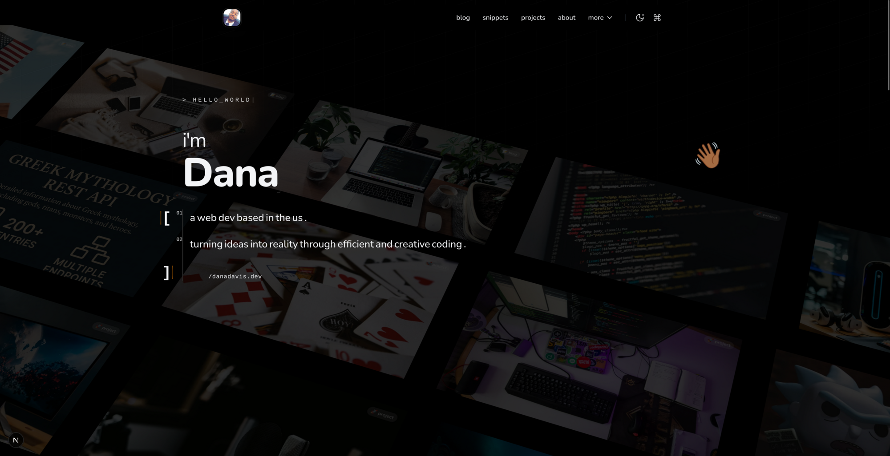

# 🚀 Dana Davis's Dev Blog

  <em>"My personal space on the cloud where I document my programming journey, sharing lessons, insights, and resources for fellow developers."</em>

  <a href="#features">Features</a> •
  <a href="#tech-stack">Tech Stack</a> •
  <a href="#additions-and-changes">Additions & Changes</a> •
  <a href="#contributing">Contributing</a>

---

## 🌟 About

Welcome to **danadavis.dev**, my personal blog and portfolio built with modern web technologies. This is where I share my experiences, tutorials, project showcases, and insights from my journey as a software engineer.

> **Sharing is learning!**  
> I started this blog to document and share things I've learned and found useful. Writing helps solidify my understanding and hopefully provides value to the developer community.

## ✨ Features

- **📝 Blog Posts**: Rich MDX-powered articles with code syntax highlighting
- **📚 Books & Movies**: Personal recommendations and reviews
- **💼 Projects Portfolio**: Showcase of my development projects
- **🔧 Code Snippets**: Reusable code snippets and utilities
- **🏷️ Tags System**: Organized content by topics
- **🔍 Search Functionality**: Powered by KBar for quick navigation
- **🌙 Dark Mode**: GitHub dark dimmed theme support
- **📊 Analytics**: Umami integration for privacy-focused tracking
- **�️ Database**: Supabase with Drizzle ORM for type-safe operations
- **🔐 Admin Panel**: Manage posts, comments, and more
- **🎵 Integrations**: Spotify now-playing, GitHub activities, and more
- **📱 Responsive Design**: Optimized for all devices

## �️ Tech Stack

| Category       | Technologies                                  |
| -------------- | --------------------------------------------- |
| **Frontend**   | Next.js 15 (App Router), React 19, TypeScript |
| **Styling**    | Tailwind CSS, PostCSS                         |
| **Content**    | Contentlayer, MDX                             |
| **Database**   | Supabase, Drizzle ORM, Prisma                 |
| **Analytics**  | Umami                                         |
| **Linting**    | Biome                                         |
| **Deployment** | Vercel                                        |

## 🔄 Additions and Changes from Original Repository

This blog is forked and heavily customized from [leohuynh.dev](https://github.com/hta218/leohuynh.dev), a Next.js starter blog. Here are the key additions and modifications:

### 🎨 UI/UX Enhancements

- **Custom Color Scheme**: Implemented Black, Orange, and Green theme (replacing default blues)
- **Enhanced Components**: Added custom UI components like gradient borders, tilted grids, and radiant cards
- **Improved Typography**: Better font handling with custom CSS and emoji support

### 📖 Content Sections

- **Books Section**: Added personal book tracking and reviews
- **Movies Section**: Movie recommendations with ratings and filters
- **Projects Portfolio**: Dedicated showcase for development projects
- **Code Snippets**: New section for sharing reusable code snippets
- **Tags System**: Comprehensive tagging for better content organization

### 🔧 Technical Additions

- **Database Integration**: Full Supabase + Drizzle ORM setup for dynamic content
- **Admin Panel**: Complete CMS for managing blog posts, comments, and analytics
- **API Routes**: Custom APIs for GitHub activities, Spotify integration, newsletter signup
- **Authentication**: Kinde Auth integration for secure admin access
- **Advanced Hooks**: Custom React hooks for activities, blog stats, intersection observer
- **Error Handling**: Improved error boundaries and logging

### 📊 Analytics & Tracking

- **Umami Analytics**: Privacy-focused website analytics
- **Post Views Counter**: Track engagement on individual posts
- **Reactions System**: User interaction features

### 🎯 Other Improvements

- **SEO Optimization**: Enhanced meta tags, sitemaps, and structured data
- **Performance**: Optimized loading with lazy components and efficient bundling
- **Accessibility**: Better ARIA labels and keyboard navigation
- **Mobile Optimization**: Responsive design improvements

## 📈 Star History

<a href="https://star-history.com/#xi-Rick/danadavis.dev&Date">
  <picture>
    <source media="(prefers-color-scheme: dark)" srcset="https://api.star-history.com/svg?repos=xi-Rick/danadavis.dev&type=Date&theme=dark" />
    <source media="(prefers-color-scheme: light)" srcset="https://api.star-history.com/svg?repos=xi-Rick/danadavis.dev&type=Date" />
    
  </picture>
</a>

## 🤝 Contributing

Contributions, issues, and feature requests are super welcome! 🍻

Feel free to:

- [Open an issue](https://github.com/xi-Rick/danadavis.dev/issues) for bugs or suggestions
- [Submit a pull request](https://github.com/xi-Rick/danadavis.dev/pulls) with improvements
- Share your thoughts in the discussions

## 📄 License

Copyright © 2019-present | Dana's dev blog – stories, insights, and ideas.

---

Made with ❤️ by [Dana Davis](https://danadavis.dev)

